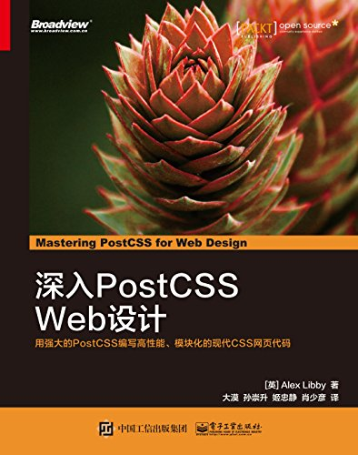

# 深入PostCSS Web设计

每一章的文件夹下都通过如下命令创建了各自的学习笔记：  
> mkdir ch01  
> type nul>README.MD  

## 第一章 PostCSS简介

主要介绍PostCSS的安装及常用插件配置，并通过一个小项目，来检测配置是否成功  

## 第二章 创建变量和混合宏

通过sass的变量和混合宏，引入了PostCSS的相关插件及应用。通过插件postcss-mixins演示了一个实例；然后学习了for语句，简单的@each函数  

## 第三章 嵌套规则

利用postcss-nesting插件转换嵌套样式，并介绍了BEM的基础知识，及相关插件的使用  
<b style="color:red;">插件postcss-bem已停止更新，并且无法在最新的postcss下使用</b>  

## 第四章 创建媒体查询  

媒体查询是构建响应式网站的核心部分，但不应该盲目执行大量的媒体查询，应考虑是否由替代方案  

## 第五章 管理颜色、图片和文字  

通过PostCSS插件，良好的管理和搭配网站的颜色、图像和文字，如postcss-sprites创建雪碧图。利用cwebp.exe优化生成webp图片。  

<b style="color:red;">postcss-webp，postcss-webpcss插件生成WebP图片未成功</b>  

## 第六章 创建网格  

通过neat插件，创建网格，生成响应式网站  

<b style="color:red;">插件node-bourbon和node-neat在编译sample.scss时报错</b>  

## 第七章 动画元素

使用动画库，或者PostCSS结合CSS3创建动画元素  

## 第八章 PostCSS插件开发

利用插件模板和基于已有插件开发自己的插件，并测试，发布  

## 第九章 简写型插件，降级插件和包型插件

探索一些常用的插件，并利用Rucksack包型插件演示了一个图片轮播的示例；还介绍了审查和优化代码的两个插件stylelint和cssnano；最后讨论了兼容低版本浏览器的插件和思考  

## 第十章 定制处理器

深入处理器代码细节，完善代码；根据项目需求增删特性，优化输出结果；了解CSSStyle库

<b style="color:red;">demo_8中的示例演示失败，插件cssstyle不起作用</b>

## 第十一章 管理自定义语法

介绍了解析自定义语法或样式的插件，分析抽象AST的插件，及支持语法高亮midas库。  

<b style="color:red;">生成源映射文件出错，所以暂时注释掉了gulp任务中的最后一行生成代码(应该是写法过时)</b>

## 第十二章 混合处理器

<b style="color:red;">本章中使用的Pleeease库已经停止更新，所以前面的几个示例难以演示成功</b>  

## 第十三章 排除，解决PostCSS的相关问题

我们在学习PostCSS的时候，会碰到各种问题。探索并解决比较常见的问题，并整理一些常见技巧，以方便使用PostCSS  

## 第十四章 为未来做准备

本章讲述了如何通过插件来使用CSS3类提供等效的实现，来替换CSS4的语法  
