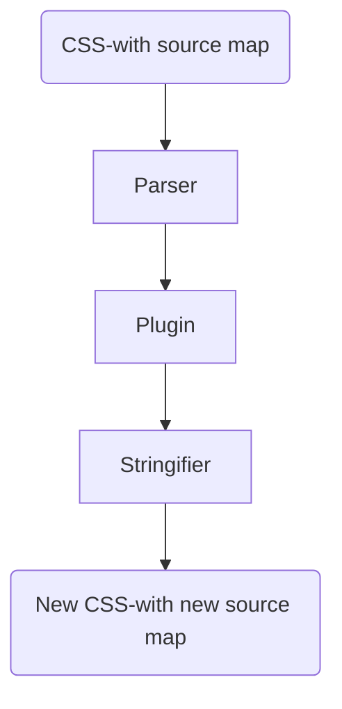

# 第十一章 管理自定义语法

## 介绍自定义语法

CSS规则集有选择器和声明块组成：  
选择器指向需要样式化的HTML元素  
声明块包含一个或多个用分号分割的声明  

## 准备开发环境

VSCode专门针对PostCSS的语法高亮插件[PostCSS Language Support](https://marketplace.visualstudio.com/items?itemName=csstools.postcss)  

## 实现自定义语法的插件

创建自定义语法的三个步骤：  

1. 首先通过解析器解析代码  
2. 然后使用任意一个插件来转换它  
3. 最终将其字符串化，或将其转化为字符串格式的有效CSS  

PostCSS支持各种CSS语法的插件  

|名称|功能|
|:---|:---|
|[sugarss](https://github.com/postcss/sugarss)|像Sass或Stylus语法那样进行缩进。npm i --save-dev sugarss|
|[postcss-less](https://github.com/shellscape/postcss-less)|减少转换成有效的CSS。npm i --save-dev postcss-less|
|[postcss-js](https://github.com/postcss/postcss-js)|任何使用JavaScript的人可以使用这个插件在JS中编写样式或转换React行内样式。npm i --save-dev postcss-js|
|[postcss-scss](https://github.com/postcss/postcss-scss)|如用Sass，此插件可完美处理Sass代码。npm i --save-dev postcss-scss|
|[postcss-safe-parser](https://github.com/postcss/postcss-safe-parser)|可以完美修复CSS语法错误。npm i --save-dev postcss-safe-parser|
|[poststylus](https://github.com/madeleineostoja/poststylus)|将Stylus转换成有效的CSS。npm i --save-dev poststylus|
|[postcss-value-parser](https://github.com/TrySound/postcss-value-parser)|将CSS声明值和规则参数转换为节点树，并提供简单的遍历API。npm i --save-dev postcss-value-parser|
|[postcss-unrgba](https://github.com/csstools/postcss-unrgba)|将rgba()转换为hex值表示。npm i --save-dev postcss-unrgba|
|[color-convert](https://github.com/Qix-/color-convert)|用于JavaScript和node的颜色转换库。 它在rgb，hsl，hsv，hwb，cmyk，ansi，ansi16，十六进制字符串和CSS关键字之间进行所有转换(将四舍五入为最接近的值)。npm i --save-dev color-convert|

### 解析内容并修复错误

> cd demo_1  
> npm init  
> 复制源码T58到项目目录  
> npm i --save-dev gulp  
> npm i --save-dev gulp-postcss  
> npm i --save-dev autoprefixer  
> npm i --save-dev postcss-safe-parser  
> npm i --save-dev graceful-fs  
> gulp  

上例用到的插件：[graceful-fs](https://github.com/isaacs/node-graceful-fs)  
上例在将修复的样式写入目标文件时，如果文件路径dest不存在，项目会报错  

### 解析SCSS内容

> cd demo_2  
> npm init  
> 复制源码T59到项目目录  
> npm i --save-dev gulp  
> npm i --save-dev gulp-postcss  
> npm i --save-dev autoprefixer  
> npm i --save-dev graceful-fs  
> npm i --save-dev postcss-nested  
> npm i --save-dev postcss-scss  
> gulp  

上例在将修复的样式写入目标文件时，如果文件路径dest不存在，项目会报错  

插件postcss-scss附带的语法处理Sass代码，配合其他插件，将内容输出到文件。整个过程脱离了对Sass编译器的依赖  

## 解析CSS

编写自定义语法的目的是分析内容的能力  

我们从CSS源文件(可能有源映射)只解析一次，然后通过使用任意数量的指定插件。我们将输出内容格式化为字符串，以方便保存到磁盘或打印到屏幕  

> cd demo_3  
> npm init  
> 复制源码T60到项目目录  
> npm i --save-dev gulp  
> npm i --save-dev postcss-value-parser  
> gulp  

本示例利用插件postcss-value-parser，来解析一段CSS代码，并在屏幕输出一个AST  
插件[postcss-safe-parser](https://github.com/postcss/postcss-safe-parser)和[postcss-selector-parser](https://github.com/postcss/postcss-selector-parser)可以实现类似的效果  
值得一提的是，插件postcss-selector-parser已经集成进PostCSS，可以直接使用，无需单独引入  

### 替换RGBA颜色

插件postcss-unrgba可以实现，但是代码不够简洁  
本例使用插件[color-convert](https://github.com/Qix-/color-convert)简洁的实现  

> cd demo_4  
> npm init  
> 复制源码T61到项目目录  
> npm i --save-dev gulp  
> npm i --save-dev postcss-value-parser  
> npm i --save-dev color-convert  
> gulp  

### 研究它是如何运作的

首先，阅读样式表文件的内容，然后使用postcss-value-parser解析它。我们遍历AST中的节点，忽略函数节点或值为RGBA的节点。  
剩余的就是我们要收集所有的字节类型的节点，此后，将我们已经转换为数字的值映射为一个单排数组。  
然后，从一个函数节点转换到一个字节点，并将值从RGBA转换为HEX颜色。同时，内容被转换为字符串，并以相同的文件名保存到目标文件夹  

## 使用API格式化输出

AST树的标准格式比较抽象，对开发者来说，阅读性比较差  
本示例将使用.toString()方法，将其保存在磁盘文件中  

> cd demo_5  
> npm init  
> 复制源码T62到项目目录  
> npm i --save-dev gulp  
> npm i --save-dev gulp-postcss  
> gulp  

<b style="color:red;">生成源映射文件出错，所以暂时注释掉了gulp任务中的最后一行生成代码</b>  

### 分析示例代码

- 使用.walkRules方法遍历每个规则，解析每个选择器并计数。  
- 本例将解析到的内容.toString()，以打印或输出。另外Stringify和Builder命令在创建自定义语法时，字符串化的表示CSS  

### 添加Source Map

gulp任务中，{inline: false}可以阻止在代码中直接创建源映射  
但是，最后生成源映射的代码函数有更新，现在的写法已经过时  

## 代码高亮语法

VSCode的高亮语法插件[PostCSS Language Support](https://marketplace.visualstudio.com/items?itemName=csstools.postcss)  
SublimeText有插件Syntax-highlightingfor-postcss  

### 安装主题

SublimeText的推荐主题Twilight Light

> cd %APPDATA%\Sublime Text 3\Packages\User  
> git clone git://github.com/chriskempson/base16-textmate.git Base16  
> Sublime Text > Preferences > Color Scheme > User  

### 创建HTML主题

使用主题插件[midas库](http://midasjs.com)
midas为HTML中的语法突出显示生成了高度可定制的基础。  
只需传入CSS字符串，它就会生成HTML输出。  
然后，您可以将其与任何包含的主题进行配对，也可以轻松地编写自己的主题。  

> cd demo_6  
> npm init  
> 复制源码T63到项目目录  
> npm i --save-dev gulp  
> npm i --save-dev gulp-postcss  
> npm i --save-dev autoprefixer  
> npm i --save-dev postcss-nested  
> npm i --save-dev postcss-scss  
> npm i --save-dev midas  
> gulp  

根据midas库官网介绍，使用之前必须初始化  
然后，在我们的gulp任务中，需要配置{stringifier: midas.stringifier}  
